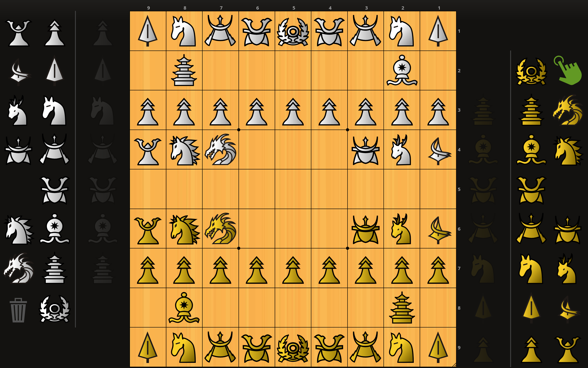

# Firi piece set
Originally designed as an icon alternative for shogi kanji pieces, soon extended for chu-shogi (covering chess) and cannon-shogi.

## Chess https://lichess.org/

## Shogi https://lishogi.org/learn

Style: https://userstyles.world/style/18241/firi-pieceset-lishogi

## Cannon-shogi https://www.pychess.org/variants/cannonshogi

Style: https://userstyles.world/style/18393/firi-pieceset-cannonshogi

## Chushogi https://lishogi.org/variant/chushogi

Style: https://userstyles.world/style/18471/firi-pieceset-chushogi-lishogi

Some pieces are inspired (most started out as tracings) of the 'International - black and white' chushogi set.

# semirelated awesome variants:
https://www.pychess.org/variants/mansindam

https://www.pychess.org/variants/shogun

https://www.pychess.org/variants/empire

https://www.pychess.org/variants/orda

https://www.pychess.org/variants/shinobiplus

https://www.pychess.org/variants/synochess

https://www.pychess.org/variants/spartan
